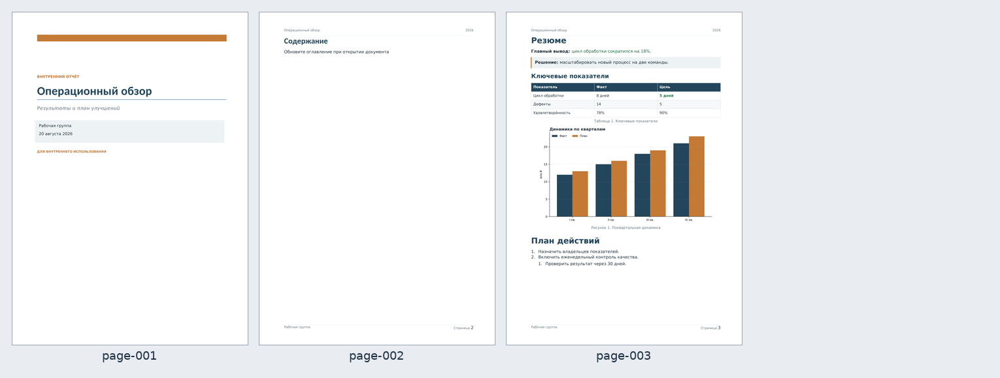
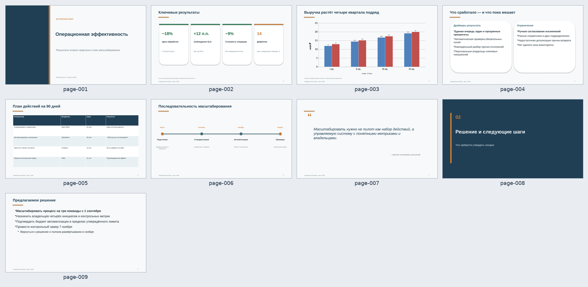
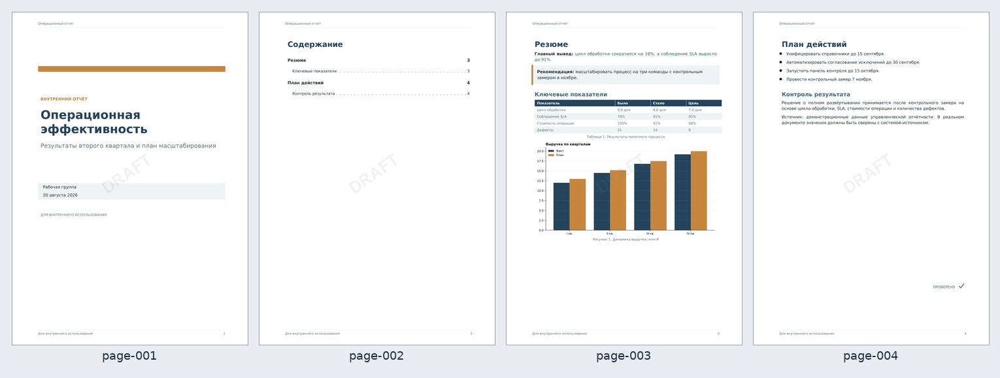

# Готовые примеры документов

Эти файлы сгенерированы `documentctl 0.6.0` полным проверочным прогоном. Это не макеты: DOCX, XLSX и PPTX остаются редактируемыми, XLSX содержит формулы и нативную диаграмму, а PDF содержит встроенные Unicode-шрифты и интерактивное оглавление.

| Формат | Готовый документ | Исходная спецификация | Что демонстрирует |
|---|---|---|---|
| Word / DOCX | [operational-review.docx](operational-review.docx) | [DOCX JSON](../docx/operational-review.json) | обложка, динамическое оглавление, колонтитулы, таблица, диаграмма и нумерация страниц |
| Excel / XLSX | [operational-dashboard.xlsx](operational-dashboard.xlsx) | [XLSX JSON](../xlsx/operational-dashboard.json) | формулы с рассчитанными кэшами, таблица, диаграмма, проверки данных, условное форматирование и области печати |
| PowerPoint / PPTX | [operational-review.pptx](operational-review.pptx) | [PPTX JSON](../pptx/operational-review.json) | 9 слайдов 16:9, редактируемые элементы, нативная диаграмма, таблица, таймлайн и заметки докладчика |
| PDF | [operational-report.pdf](operational-report.pdf) | [PDF JSON](../pdf/operational-report.json) | Unicode, оглавление и закладки, таблица, диаграмма, watermark и проверочная overlay-аннотация |

> GitHub обычно предлагает скачать Office-файлы. PDF открывается непосредственно в браузере. Быстрый внешний вид всех документов показан ниже.

## DOCX

[](operational-review.docx)

## XLSX

[](operational-dashboard.xlsx)

## PPTX

[](operational-review.pptx)

## PDF

[](operational-report.pdf)

## Контроль качества

Для этой сборки пройдены:

- Microsoft Open XML SDK / Microsoft 365 schema validation: 0 ошибок;
- LibreOffice WASM render/recalculation;
- PDFium rasterization и визуальный просмотр контактных листов;
- Tesseract.js OCR `rus+eng`;
- проверки встроенных шрифтов, активного содержимого, формул и package relationships;
- полный набор DOCX/XLSX/PPTX/PDF/System evals.

SHA-256:

```text
ebf7d355b7a5f3dc542f50c53311a478a9771956eb7127093915a32faf8f5049  operational-review.docx
bbb3e7b40c2e3311e348e3d03764b565e3cc5232ec7fd4a03700409c92250d68  operational-dashboard.xlsx
308ba06e9371a5c67665612893f849c2b09970ef67c242ecc4bd97edcd9e6dd2  operational-review.pptx
56e27705ca0404cb4ec7a907c62772a75b4377e7682c39cdb66e0f9fd5463e4f  operational-report.pdf
```
