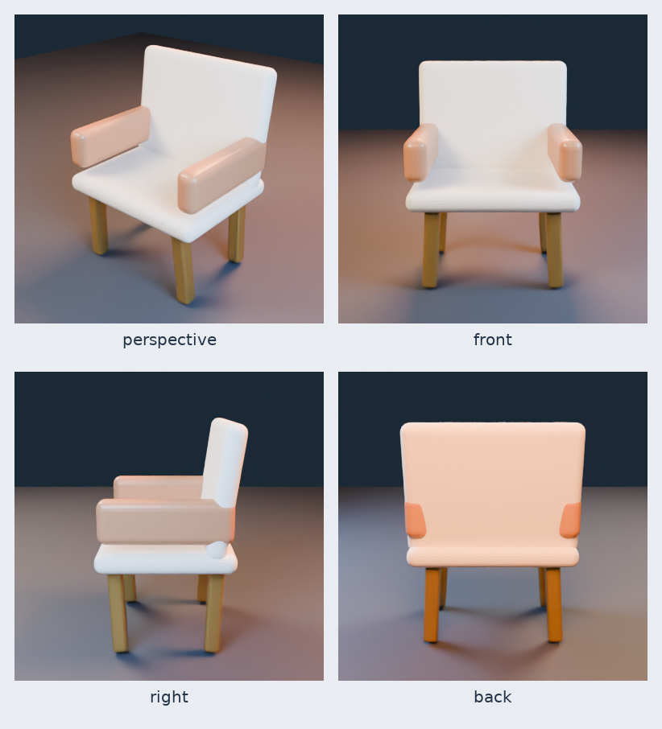

# Generated 3D example

- [Download `lounge-chair.glb`](lounge-chair.glb)
- [Declarative source specification](../lounge-chair.json)
- SHA-256: `959a93ab4e9ee0031b49dc13dd0196d222bdc18a55f9c33bfff753a8d536ef1c`

Validation evidence for this build:

- Blender `4.5.12 LTS`, restricted declarative worker;
- 8 named mesh objects;
- 3 named PBR materials;
- 2,464 triangles;
- Khronos glTF Validator: 0 errors, 0 warnings;
- topology QA: 0 errors, 0 warnings;
- four nonblank Cycles CPU views;
- source remains editable as separate named objects in the GLB scene.

This is a deterministic engineering smoke-test asset, not a neural text-to-3D output or a claim of the platform's eventual maximum artistic complexity.
